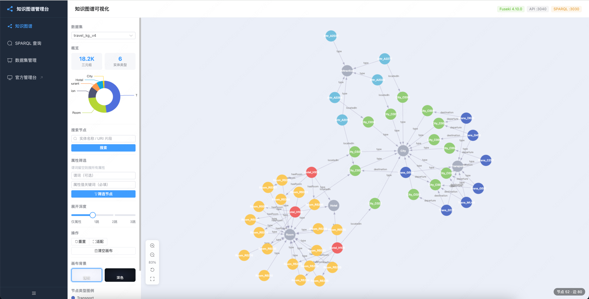
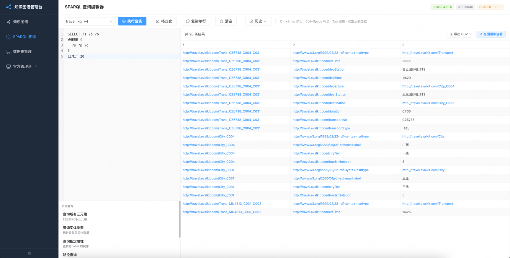
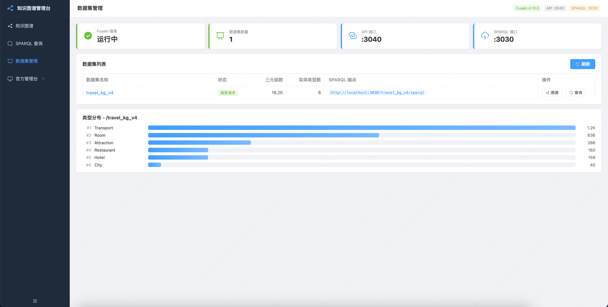
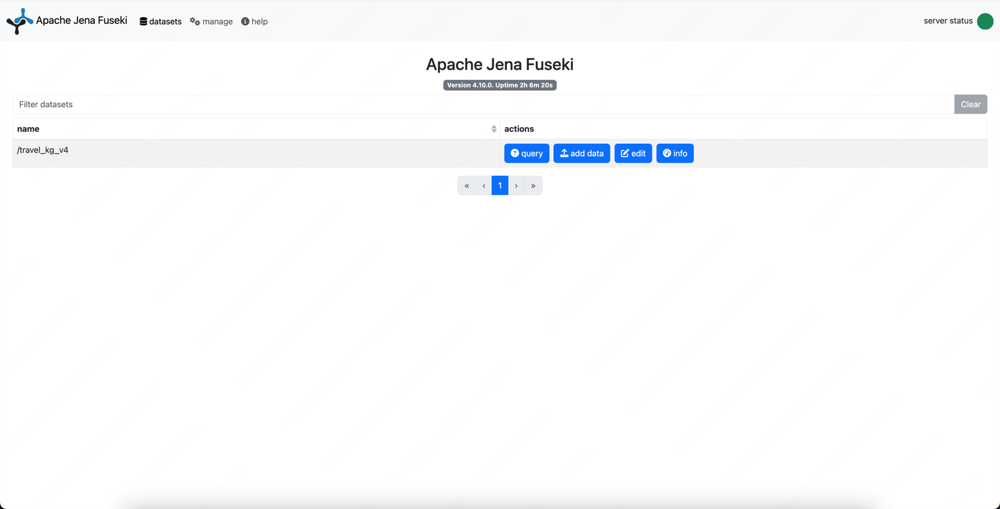

# jena-fuseki-plus

[](https://www.apache.org/licenses/LICENSE-2.0)
[](https://www.oracle.com/java/)
[](https://github.com/zendodx/jena-fuseki-spring-boot-starter/stargazers)
[](https://github.com/zendodx/jena-fuseki-spring-boot-starter/forks)

基于 Apache Jena Fuseki 4.10.0 的二次开发项目，将 Fuseki 嵌入 Spring Boot，并提供知识图谱可视化管理台。

---

## 项目概述

### 演示截图

示例知识图谱数据: [travel_kg_v4.ttl](docs/assets/travel_kg_v4.ttl)

知识图谱可视化



SPARQL查询



数据集管理



官方管理台



### 核心能力

| 模块             | 说明                                                       |
|----------------|----------------------------------------------------------|
| **嵌入式 Fuseki** | Spring Boot 启动时自动拉起 Fuseki，统一生命周期管理，不改动 Fuseki 原有接口      |
| **图谱可视化**      | 力导向布局渲染知识图谱，支持节点展开、属性筛选、右键菜单、深色/浅灰背景切换                   |
| **SPARQL 编辑器** | CodeMirror 6 编辑器，内置关键词/谓词/变量智能提示，Ctrl+Enter 执行，结果可导出 CSV |
| **数据集管理**      | 查看 Fuseki 数据集状态、三元组统计、类型分布                               |
| **跨页联动**       | SPARQL 查询结果可一键跳转图谱页渲染（自动推断非 s/p/o 列）                     |

### 技术栈

- **后端**：Java 11 · Spring Boot 2.7 · Apache Jena Fuseki 4.10.0
- **前端**：Vue 3 · Vite · Element Plus · ECharts · CodeMirror 6

### 端口规划

| 端口     | 服务                         |
|--------|----------------------------|
| `3030` | Fuseki SPARQL 服务（原生，不对外暴露） |
| `3040` | Spring Boot API 服务         |
| `5173` | Vite 前端开发服务器（dev 模式）       |

---

## 目录结构

```
jena-fuseki-plus/
├── jena-fuseki-plus-server/        # Spring Boot 后端
│   ├── libs/
│   │   └── apache-jena-fuseki-4.10.0/   # Fuseki 发行包（fuseki-server.jar）
│   ├── run/                        # FUSEKI_BASE 运行目录
│   │   ├── configuration/          # 数据集 TTL 配置
│   │   ├── databases/              # TDB2 数据存储
│   │   ├── logs/                   # Fuseki 运行日志
│   │   └── system/                 # Fuseki 系统配置
│   └── src/main/java/io/github/jenafuseki/plus
│       ├── fuseki/                 # Fuseki 嵌入启动模块
│       └── extension/              # 扩展接口（图谱/SPARQL代理/数据集管理）
└── jena-fuseki-plus-ui/            # Vue 3 前端
    └── src/
        ├── views/                  # 页面组件
        ├── api/                    # 接口封装
        └── stores/                 # Pinia 跨页状态
```

---

## 启动流程

### 前置条件

- Java 11+
- Maven 3.6+
- Node.js 18+ / npm

---

### 方式一：一键启动脚本（推荐）

项目根目录提供 `dev-start.sh` / `dev-stop.sh`，自动完成「启动后端 → 健康检查 → 启动前端」全流程：

```bash
# 首次使用授权（只需执行一次）
chmod +x dev-start.sh dev-stop.sh dev-status.sh
```

#### 前台模式（默认）

```bash
./dev-start.sh
```

终端实时输出前后端日志，按 **Ctrl+C** 同时停止所有进程。

#### 后台模式（`--daemon`）

```bash
./dev-start.sh --daemon
```

服务在后台运行，脚本立即返回命令行。PID 和日志路径写入 `.dev.pid`。

```bash
# 查看运行状态（进程 / 端口 / 健康检查）
./dev-status.sh

# 查看运行状态 + 最近 20 行日志
./dev-status.sh --log

# 停止后台服务
./dev-stop.sh

# 强制清理端口（不依赖 PID 文件）
./dev-stop.sh --force

# 查看实时日志（路径在启动时打印）
tail -f /tmp/jena-fuseki-plus-backend.XXXXXX
tail -f /tmp/jena-fuseki-plus-frontend.XXXXXX
```

启动成功后终端会显示所有访问地址：

```
  前端管理台  http://localhost:5173
  后端 API   http://localhost:3040/api
  Fuseki     http://localhost:3030
  Actuator   http://localhost:3040/actuator/health
```

> **脚本行为：**
> 1. 检查 `java` / `mvn` / `node` / `npm` / `curl` 是否已安装
> 2. 检查 `:3030` / `:3040` / `:5173` 端口是否空闲
> 3. 后台启动后端，每 2 秒轮询 `/api/fuseki/health`，最长等待 120 秒
> 4. 后端就绪后自动启动前端（缺少 `node_modules` 时自动执行 `npm install`）
> 5. 前台模式：Ctrl+C 触发清理；后台模式：PID 持久化到 `.dev.pid`，`dev-stop.sh` 读取后清理

---

### 方式二：手动分步启动

#### 1. 启动后端

```bash
cd jena-fuseki-plus-server
mvn spring-boot:run
```

Spring Boot 启动后会自动：

1. 拉起 Fuseki（监听 `:3030`），扫描 `run/configuration/` 下的 TTL 配置加载数据集
2. 启动 Spring Boot API 服务（监听 `:3040`）

等待控制台出现以下日志表示启动成功：

```
[Fuseki] 启动参数 = [--port=3030]
Started Server on port 3030
Started App in X.XXX seconds
```

#### 2. 启动前端（开发模式）

```bash
cd jena-fuseki-plus-ui
npm install        # 首次安装依赖
npm run dev
```

访问 [http://localhost:5173](http://localhost:5173)

> 开发模式下 Vite 自动代理：`/api` → `:3040`，`/travel_kg_v4` → `:3030`

#### 3. 停止服务

```bash
# 释放端口（一键清理）
lsof -ti :3030 -sTCP:LISTEN | xargs kill -9 2>/dev/null
lsof -ti :3040 -sTCP:LISTEN | xargs kill -9 2>/dev/null
```

---

## 配置说明

后端配置文件：`jena-fuseki-plus-server/src/main/resources/application.yml`

```yaml
server:
  port: 3040          # Spring Boot API 端口

fuseki:
  port: 3030          # Fuseki SPARQL 端口
  home: ""            # FUSEKI_HOME，留空自动推断为 libs/apache-jena-fuseki-4.10.0
  base: ""            # FUSEKI_BASE，留空自动推断为 run/
  start-timeout-seconds: 60
  allow-update: true
  config-file: ""     # 指定单个 TTL 配置（留空则扫描 base/configuration/）
  mem-dataset: false  # true=使用内存数据集（仅开发测试）
  dataset-path: /ds   # mem-dataset=true 时的挂载路径
  verbose: false
```

---

## 主要 API

| 接口                              | 说明                      |
|---------------------------------|-------------------------|
| `GET /api/fuseki/datasets`      | 获取所有数据集列表               |
| `GET /api/fuseki/health`        | Fuseki 健康状态             |
| `POST /api/fuseki/sparql`       | SPARQL 查询代理（转发到 Fuseki） |
| `GET /api/graph/neighbors`      | 查询节点邻居（支持 0~3 跳）        |
| `GET /api/graph/node`           | 节点所有属性详情                |
| `GET /api/graph/search`         | 关键词搜索节点                 |
| `GET /api/graph/search-by-prop` | 按谓词+属性值精确筛选节点           |
| `POST /api/graph/sparql`        | 自定义 SPARQL 转图谱结构        |
| `GET /api/graph/overview`       | 数据集统计（三元组数、类型分布）        |
| `GET /api/graph/predicates`     | 获取数据集中所有谓词（供编辑器补全）      |
